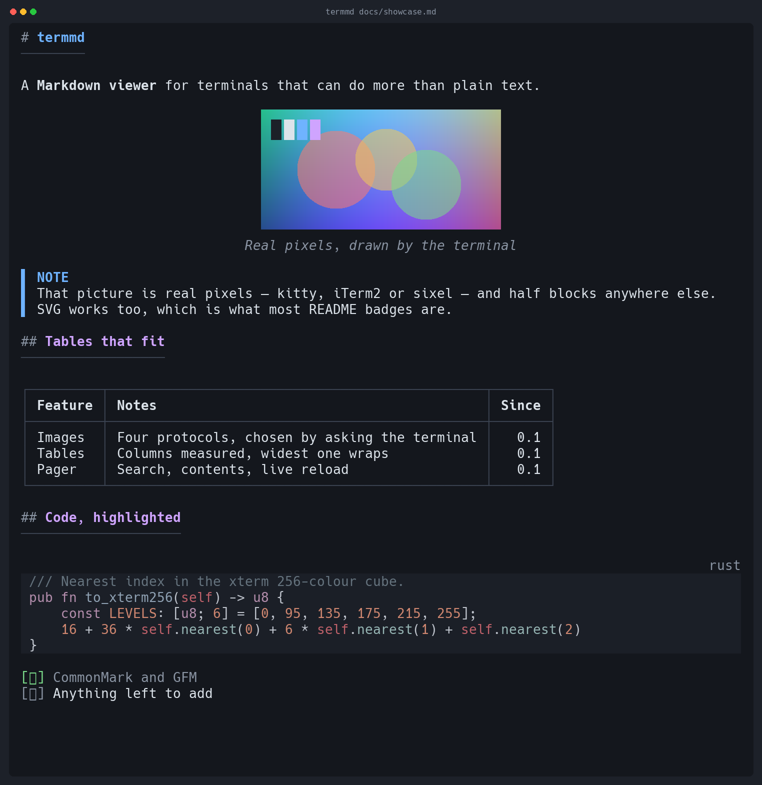
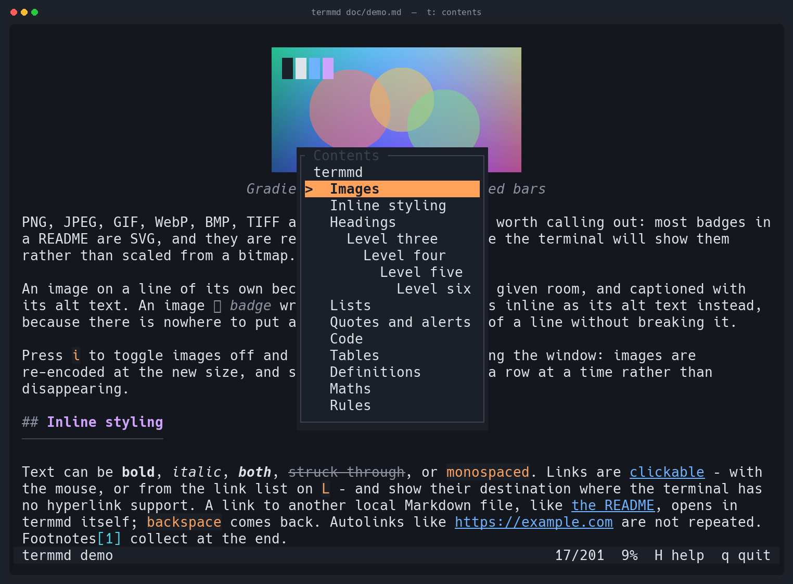

# termmd

[](https://github.com/EdMUK/termmd/actions/workflows/ci.yml)
[](https://crates.io/crates/termmd)
[](LICENSE)

**[edmuk.github.io/termmd](https://edmuk.github.io/termmd/)**

A Markdown viewer for terminals that can do more than plain text.

Terminals have quietly become capable. They do 24-bit colour, they draw images
through three different protocols, they have clickable hyperlinks, and they know
how wide a Japanese character is. Most terminal Markdown viewers were written
before some of that was true, and it shows: tables come out ragged or missing,
images turn into `[image]`, CJK text overflows the right margin, and a wide table
is simply cut off.

`termmd` is an attempt to use what the terminal actually offers.

<p align="center">
  
</p>

<p align="center">
  <em>Real output. The picture in the middle is drawn by the terminal, through the kitty graphics protocol.</em>
</p>

## What it does

**Images, actually rendered.** Four backends, chosen automatically: the kitty
graphics protocol, iTerm2's inline images, DEC sixel, and Unicode half blocks.
The first three draw real pixels. The last one works anywhere with 256 colours,
including inside tmux and over ssh, so an image is never just a caption.

PNG, JPEG, GIF, WebP, BMP, TIFF and **SVG** — which matters more than it sounds,
because most badges in a README are SVG. Vector images are rendered at the exact
pixel size the terminal will show, rather than rasterised once and scaled, so
small text in a badge stays legible.

Remote images are **off by default**: opening a document should not make network
requests you did not ask for. Pass `--remote-images`, or set
`remote-images = true` in the config, to fetch them. An image that cannot be
shown says why — `(remote image, run with --remote-images)`, `(file not found)`,
`(cannot read AVIF image)` — rather than silently leaving a gap.

**Tables that fit.** Column widths are measured, not guessed. Spare room goes to
the columns that need it; when space runs short the widest column wraps while
`1.2.0` and `Yes` stay intact. Below the width where a grid stops being readable,
the table becomes a list of records rather than a mangled box.

**Emoji shortcodes.** `:rocket:` is drawn as a rocket, using the same alias set
GitHub accepts. Code spans and code blocks keep the name, and so does `--ascii`,
where there is nothing to draw it with.

**Maths, as far as Unicode goes.** `$E = mc^2$` renders as `E = mc²`,
`\frac{a+b}{2}` as `(a+b)/2`, `\alpha \leq \beta` as `α ≤ β`. What has no
character — a matrix, a fifth root, a superscript Unicode never encoded — is
left exactly as it was written, because a reader can still read TeX.

**Typography.** Text is measured in display columns over grapheme clusters, so
CJK, emoji, and combining accents wrap where they should. Lists hang their
continuation lines under the text. Quotes carry a bar down the whole block.
GitHub alerts (`> [!WARNING]`) get their own colour and label.

**Syntax highlighting** for 213 languages and 32 code themes, through
[`syntect`](https://github.com/trishume/syntect) with the extended grammar and
theme set from [`two-face`](https://codeberg.org/CosmicHarper/two-face). Fence
languages are resolved through aliases (`rs`, `js`, `yml`, `console`), and a
block with no language at all is sniffed from its first line.

**An interactive pager**: search with live highlighting, a table of contents you
can jump from, a link list, horizontal scrolling for wide tables, and live reload
on file change. Links are clickable, and a link to another local Markdown file
opens in termmd itself — `backspace` goes back — so a directory of documents is
browsable without leaving the terminal. A document that already fits on one
screen is just printed.

<p align="center">
  
</p>

<p align="center">
  <em>The pager, with the table of contents open on <code>t</code>.</em>
</p>

**It degrades honestly.** Truecolor falls back to 256, then 16, then to bold and
underline. Box drawing falls back to ASCII. Every fallback can be forced, and
`termmd --caps` shows what was detected and why.

## Install

### Homebrew

```sh
brew install EdMUK/tap/termmd
```

The formula takes the prebuilt binary for your platform rather than compiling,
on macOS and Linux, Intel and Arm.

### Prebuilt binaries

Download an archive for your platform from the
[releases page](https://github.com/EdMUK/termmd/releases), unpack it, and put
`termmd` somewhere on your `PATH`:

```sh
# macOS (Apple silicon); swap the target for your platform
curl -sSL https://github.com/EdMUK/termmd/releases/latest/download/termmd-aarch64-apple-darwin.tar.gz \
  | tar xz
sudo install termmd-aarch64-apple-darwin/termmd /usr/local/bin/termmd
```

The available targets are `aarch64-apple-darwin`, `x86_64-apple-darwin`,
`x86_64-unknown-linux-gnu`, `aarch64-unknown-linux-gnu`, and
`x86_64-pc-windows-msvc`.

Each archive carries the man page as `termmd.1` and completion scripts for five
shells under `completions/`, alongside the README, the licence and an example
config.

Each release also has a `SHA256SUMS` file if you want to check the download.

macOS may quarantine a binary downloaded with a browser. If it refuses to run:

```sh
xattr -d com.apple.quarantine /usr/local/bin/termmd
```

### With cargo

```sh
cargo install termmd
```

Or [`cargo-binstall`](https://github.com/cargo-bins/cargo-binstall), which takes
the release archive above rather than compiling:

```sh
cargo binstall termmd
```

Or straight from the repository, which does not wait on a crates.io release:

```sh
cargo install --git https://github.com/EdMUK/termmd
```

### From source

```sh
git clone https://github.com/EdMUK/termmd
cd termmd
cargo install --path .
```

Requires Rust 1.85 or later. `cargo install --no-default-features` drops SVG
support and its dependencies, which makes for a smaller binary if you do not
care about badges.

### Check it works

```sh
termmd --caps        # what termmd detected about your terminal
termmd docs/demo.md  # everything it can draw, in one document
```

### Completions and the man page

A release archive already contains both. Otherwise the binary writes them
itself, from the same definition the flags are parsed with, so neither can
describe a version of termmd you do not have:

```sh
termmd --completions zsh > ~/.zfunc/_termmd          # or bash, fish, powershell, elvish
termmd --man > /usr/local/share/man/man1/termmd.1
```

## Usage

```sh
termmd README.md              # interactive pager
termmd -P README.md           # print and exit
termmd *.md                   # several files, labelled and concatenated
curl -s example.com/doc.md | termmd
termmd --remote-images R.md   # fetch http(s) images — off by default
termmd --watch NOTES.md       # re-render on save
termmd --toc README.md        # just the table of contents
termmd --caps                 # what termmd detected about your terminal
```

If a picture is missing, it is almost always a remote one: most README badges
live at an `http(s)` URL, and termmd does not fetch those unless asked. The
placeholder says so where the image would have been —
`🖼 Build (remote image, run with --remote-images)` — and `remote-images = true`
in the config makes it the default.

Piped output is plain text with no escape sequences, so `termmd doc.md | grep`
behaves. Use `--color=always` to keep the colour through a pipe.

### Options

| Flag | Effect |
|:--|:--|
| `-w`, `--width <COLS>` | Text width. Defaults to the terminal, capped at 100. |
| `--margin <COLS>` | Left and right margin. |
| `-p`, `--pager` / `-P`, `--no-pager` | Force the pager on or off. |
| `--plain` | No styling, no images, plain text. |
| `-t`, `--theme <NAME\|PATH>` | `dark`, `light`, `mono`, or a theme file. |
| `--syntax-theme <NAME>` | Code theme; see `--list-themes`. |
| `--color <WHEN>` | `auto`, `always`, `never`, `16`, `256`, `truecolor`. |
| `--images <PROTOCOL>` | `auto`, `kitty`, `iterm2`, `sixel`, `blocks`, `none`. |
| `--remote-images` | Fetch `http(s)` images. Off by default. |
| `--no-default-features` | (build) drop SVG support and its dependencies. |
| `--links <MODE>` | `auto`, `hyperlink`, `inline`, `reference`, `hide`. |
| `-n`, `--line-numbers` | Line numbers beside code blocks. |
| `--ascii` | Draw with ASCII only. |
| `--watch` | Re-render when the file changes. |
| `--completions <SHELL>` | Write a completion script to stdout. |
| `--man` | Write the man page, as roff, to stdout. |

### Keys

| Key | Action |
|:--|:--|
| `j` `k` arrows | Scroll a line |
| `space` `b` | Scroll a page |
| `d` `u` | Scroll half a page |
| `g` `G` | Start, end |
| `h` `l` `0` | Scroll sideways |
| `/` `?` `n` `N` | Search forwards, backwards, next, previous |
| `t` | Table of contents |
| `L` | Links |
| `backspace` | Back to the previous document |
| drag | Select text, as in any other terminal output |
| `m` | Give termmd the mouse, so clicks follow links |
| `i` | Toggle images |
| `r` | Reload |
| `H` `F1` | Help |
| `q` `esc` | Quit |

**The mouse belongs to your terminal.** Reporting the mouse to the application is
what stops you dragging to select and copy, and selecting text is something
people need far more often than clicking a link. So termmd does not ask for the
mouse. It turns on alternate scroll instead, which makes the terminal translate
wheel events into arrow keys: the wheel scrolls, drag selects, and your terminal
handles link clicks itself.

Press `m` if you want the other arrangement — termmd sees clicks and can follow
links itself, including in-document `#anchors` and links to other local Markdown
files, which no terminal can do. `shift`-drag still selects while that is on, and
`mouse = true` in the config makes it the default.

## Terminal support

| Terminal | Images | Colour | Hyperlinks |
|:--|:--|:--|:--|
| kitty, Ghostty, WezTerm | kitty protocol | truecolor | yes |
| iTerm2 | kitty protocol (3.5+), else iTerm2 protocol | truecolor | yes |
| foot, mlterm, xterm (`-ti vt340`) | sixel | truecolor | varies |
| Windows Terminal, Konsole | sixel | truecolor | yes |
| Alacritty, Terminal.app, anything else | half blocks | 256 or 16 | varies |
| tmux 3.4+, on a sixel terminal | sixel, drawn by tmux | inherited | inherited |
| tmux otherwise, screen | half blocks | inherited | inherited |

Detection is by live query where possible: `termmd` asks the terminal what it
supports and only falls back to guessing from `TERM` when nothing answers.

Inside tmux the terminal that answers is tmux, and its answers are about itself:
it claims sixel whether or not the terminal it is drawing on could show one. So
termmd asks tmux instead — `tmux display-message -p '#{client_termfeatures}'`
reports what tmux decided the *client* can do. A client that does sixel gets
pictures, drawn by tmux from 3.4 onwards without any passthrough involved, and
one that does not keeps half blocks. Hyperlinks work the same way. Under GNU
screen, or an older tmux that names neither feature, it stays on half blocks.

Sixel is encoded by termmd itself, including the colour quantisation: median cut
over a 15-bit histogram, Floyd–Steinberg dithering, and run-length encoded
output. There is no `libsixel` dependency.

## Configuration

`~/.config/termmd/config.toml`, or `$TERMMD_CONFIG`:

```toml
# Themes: a built-in name, or a file in ~/.config/termmd/themes/
theme = "dark"
# Or pick per background, when the terminal tells us what its background is:
light-theme = "light"
dark-theme  = "dark"

syntax-theme = "base16-ocean.dark"

width  = 100
margin = 1

pager  = true
mouse  = true
images = true
remote-images = false
max-image-rows = 24

links = "auto"          # auto | hyperlink | inline | reference | hide
line-numbers = false
heading-rules = true
```

Unknown keys are an error rather than being ignored, so a typo is reported
instead of quietly doing nothing.

### Themes

A theme is a TOML file that layers over a built-in one:

```toml
name = "midnight"
base = "dark"

h1          = "#8be9fd bold underline"
h2          = "#bd93f9 bold"
inline_code = "#ffb86c on #282a36"
link_text   = "#8be9fd underline"
quote_bar   = "#6272a4"
table_stripe = "none"
```

A style is a colour and any number of attributes, in any order: `bold`, `dim`,
`italic`, `underline`, `strike`, `reverse`, and `on <colour>` for a background.
Colours are `#rgb`, `#rrggbb`, a name (`red`, `bright-blue`), or `@N` for palette
index N — which follows the user's own terminal colours rather than fixing an RGB
value.

## How it fits together

```text
source text ──▶ markdown::parse ──▶ Document ──▶ render ──▶ Screen ──▶ terminal
                                     (tree)                (styled lines)
```

The `Screen` in the middle is the important boundary. Both the print path and the
interactive pager consume the same value, so what you see when you scroll is
exactly what you get when you pipe — and layout can be tested by rendering a
document at a fixed width and asserting on plain text, with no terminal involved.

## Screenshots

The images above are generated by [`docs/tools/screenshot.py`](docs/tools/screenshot.py),
which runs termmd on a pty, parses the escape sequences it actually emits into a
grid of cells, and draws that grid with a monospace font. Images are decoded from
the escape stream -- kitty transmissions, and sixel through a decoder that reads
the bands back into pixels -- and composited at the cell position termmd placed
them. They are renderings of real output, not
mockups, and you can regenerate them:

```sh
cargo build --release
python3 docs/tools/screenshot.py docs/showcase.md docs/images/screenshot.png --rows 46
```

## Prior art

Several terminal Markdown viewers came first, and this one is better for having
looked at what they do:

- [glow](https://github.com/charmbracelet/glow) — a polished TUI browser for
  local and remote documents. At the time of writing it does not render images.
- [mdcat](https://github.com/swsnr/mdcat) — the tool that showed terminal
  Markdown could include real pictures. At the time of writing it does not render
  tables.
- [bat](https://github.com/sharkdp/bat) — not a Markdown renderer, but its
  handling of syntax themes and the ANSI palette convention is worth knowing
  about if you work on this sort of thing.

No code was taken from any of them. The protocol implementations here are written
from the published specifications — kitty's
[graphics protocol](https://sw.kovidgoyal.net/kitty/graphics-protocol/), iTerm2's
[inline images](https://iterm2.com/documentation-images.html), and DEC sixel.

## Licence

[MIT](LICENSE).

The dependencies are permissively licensed too — mostly MIT or Apache 2.0, with
`tiny-skia` (reached through `resvg`) under BSD 3-Clause. `cargo tree` will show
you the full set, and `cargo install --no-default-features` removes the SVG
stack entirely.
